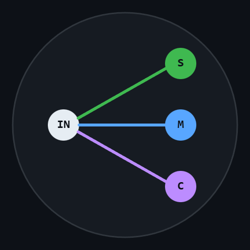

# FreeRouter — Free, Self-Hosted AI Model Router

<p align="center">
  
</p>

**Stop overpaying for AI. Route every request to the right model — automatically, with your own API keys. No middleman, no markup.**

[](https://github.com/openclaw/openclaw)
[](LICENSE)
[](tests/)

---

## Why FreeRouter?

**You already have API keys. Why pay someone else to use them?**

| Pain | How FreeRouter Fixes It |
|------|------------------------|
| 💸 **Middleman markup** — OpenRouter and similar services charge on top of provider prices | **Zero markup.** Self-hosted, runs locally. You pay providers directly. |
| 🔥 **Every message hits your expensive model** — Opus at $75/M output tokens for "hello"? | **14-dimension classifier** routes simple messages to cheap models automatically. Save 60-80%. |
| 🎰 **No control over routing** — auto-classifiers get it wrong sometimes | **Mode overrides.** Prefix `/max` or `[simple]` to force a tier when you know better. |
| ⏳ **Proxies that hang** — upstream is slow, your app freezes | **Request timeouts + auto-fallback.** Times out → retries with fallback model. |
| 🔧 **Hardcoded configs** — want to change a model? Edit source code, recompile, restart | **External config file.** Edit JSON, hit `/reload-config`. No restart needed. |

## Features

- **Smart routing** — 14-dimension weighted classifier scores every request and picks the best model
- **Mode overrides** *(new in v1.3.0)* — force a tier with `/max`, `/simple`, `[complex]`, `deep mode:` etc.
- **Zero cost** — no subscription, no per-token fees, no payment layer
- **External config** — `freerouter.config.json` for providers, tiers, boundaries, auth
- **Request timeouts** — per-tier timeouts with automatic fallback to secondary model
- **Tool call translation** — bidirectional Anthropic ↔ OpenAI format translation
- **OpenAI-compatible API** — drop-in replacement; works with any client that speaks `/v1/chat/completions`
- **75/75 test suite** — core routing, streaming, tool calls, unicode, concurrency, mode overrides

## How It Works

```
Your App → FreeRouter (:18800) → Classifier → Best Model
                                    ├── SIMPLE    → Kimi K2.5     (near-zero cost)
                                    ├── MEDIUM    → Sonnet 4.5    (balanced)
                                    ├── COMPLEX   → Opus 4.6      (powerful)
                                    └── REASONING → Opus 4.6      (max thinking)
```

The classifier scores each message on 14 dimensions (vocabulary complexity, reasoning depth, code complexity, domain specificity, etc.) and routes to the cheapest model that can handle it. Context-aware — includes last 3 messages in scoring.

## Mode Overrides *(v1.3.0)*

Sometimes you know better than the classifier. Prefix your prompt to force a tier:

### Slash Prefix
```
/simple What's 2+2?
/max Analyze this distributed system architecture for race conditions
/reasoning Prove that P(A|B) = P(B|A)P(A)/P(B)
```

### Bracket Prefix
```
[complex] Refactor this module to use dependency injection
[simple] Translate "hello" to French
```

### Word Prefix
```
deep mode: Why does this recursive CTE produce duplicates?
basic mode, What time is it in Tokyo?
```

### Alias Table

| Aliases | Routes to |
|---------|-----------|
| `simple`, `basic`, `cheap` | SIMPLE — cheapest model |
| `medium`, `balanced` | MEDIUM — general purpose |
| `complex`, `advanced` | COMPLEX — powerful model |
| `max`, `reasoning`, `think`, `deep` | REASONING — maximum thinking |

The prefix is **stripped** before forwarding — the LLM never sees it. When no prefix is detected, normal classification runs.

## Quick Start

### 1. Clone & Build

```bash
git clone https://github.com/openfreerouter/freerouter.git
cd freerouter
npm install
npx tsc
```

### 2. Configure

Copy and edit the config file:

```bash
cp freerouter.config.json ~/.config/freerouter/config.json
# Edit providers, API keys, tier mappings
```

Or set API keys via environment variables. See [Configuration](#configuration) below.

### 3. Run

```bash
node dist/src/server.js
# Listening on http://localhost:18800
```

### 4. Use

Point any OpenAI-compatible client at `http://localhost:18800/v1/chat/completions`.

```bash
# Health check
curl http://localhost:18800/health

# Chat
curl http://localhost:18800/v1/chat/completions \
  -H "Content-Type: application/json" \
  -d '{"model":"auto","messages":[{"role":"user","content":"Hello!"}]}'
```

## Configuration

FreeRouter looks for config in this order:
1. `FREEROUTER_CONFIG` environment variable
2. `./freerouter.config.json` (working directory)
3. `~/.config/freerouter/config.json`

If no config file exists, built-in defaults apply.

### Config File Structure

```json
{
  "providers": {
    "anthropic": { "baseUrl": "https://api.anthropic.com", "api": "anthropic" },
    "kimi": { "baseUrl": "https://api.moonshot.cn", "api": "openai" }
  },
  "tiers": {
    "SIMPLE": { "model": "kimi-for-coding", "provider": "kimi", "fallback": "claude-haiku-4-5-20250315" },
    "MEDIUM": { "model": "claude-sonnet-4-5-20250514", "provider": "anthropic" },
    "COMPLEX": { "model": "claude-opus-4-0-20250115", "provider": "anthropic" },
    "REASONING": { "model": "claude-opus-4-0-20250115", "provider": "anthropic" }
  }
}
```

Reload without restart: `curl http://localhost:18800/reload-config`

## OpenClaw Integration

Add to your `openclaw.json`:

```json
{
  "providers": {
    "freerouter": {
      "baseUrl": "http://localhost:18800",
      "api": "openai-completions",
      "models": [{ "id": "auto" }]
    }
  },
  "agents": {
    "defaults": { "model": "freerouter/auto" }
  }
}
```

## Endpoints

| Endpoint | Description |
|----------|-------------|
| `POST /v1/chat/completions` | Main chat endpoint (OpenAI-compatible) |
| `GET /health` | Health check with uptime and timeout count |
| `GET /stats` | Request statistics by tier |
| `GET /v1/models` | List available models |
| `GET /config` | View current config (secrets redacted) |
| `POST /reload` | Reload auth keys |
| `POST /reload-config` | Reload config file |

## The 14-Dimension Classifier

Each message is scored across 14 dimensions:

| Dimension | What It Measures |
|-----------|-----------------|
| Token count | Message length |
| Vocabulary complexity | Rare/technical words |
| Syntax complexity | Nested clauses, conditionals |
| Domain specificity | Specialized knowledge needed |
| Ambiguity | How open-ended the request is |
| Context dependency | Needs prior conversation |
| Reasoning depth | Logical steps required |
| Creativity level | Original generation needed |
| Emotional complexity | Nuance in tone/sentiment |
| Multimodality | References to images/files |
| Instruction complexity | Multi-step instructions |
| Knowledge recency | Needs current information |
| Code complexity | Programming difficulty |
| Mathematical complexity | Formal math/proofs |

Scores are weighted and combined. Tier boundaries are configurable.

## Cost Impact

| Scenario | Estimated Daily Cost |
|----------|---------------------|
| All Opus (no routing) | ~$50/day |
| With FreeRouter | ~$10-15/day |
| **Savings** | **60-80%** |

Most messages are simple. Those go to Kimi at near-zero cost. Only complex work hits Opus.

## Project Structure

```
freerouter/
├── src/
│   ├── server.ts          # HTTP server + mode override detection
│   ├── provider.ts        # Multi-provider forwarding + SSE translation
│   ├── auth.ts            # API key management
│   ├── config.ts          # External config loader
│   ├── logger.ts          # Request logging
│   └── router/
│       ├── index.ts       # 14-dimension classifier
│       ├── config.ts      # Tier mappings + scoring weights
│       └── rules.ts       # Keyword-based overrides
├── tests/
│   ├── test-proxy.sh      # Core tests (33 + 5 mode override tests)
│   └── test-proxy-extended.sh  # Extended tests (37)
├── freerouter.config.json # Example config
├── tsconfig.json
└── package.json
```

## Credits

Forked from [BlockRunAI/ClawRouter](https://github.com/BlockRunAI/ClawRouter) (MIT License). Routing engine preserved; x402 payment protocol removed entirely. Credit to BlockRunAI for the original classifier design.

## License

[MIT](LICENSE)
